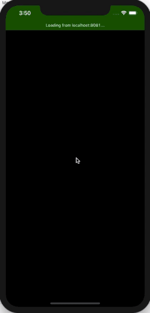

# React Native Hook Template

## Description
* Template project use fully Hook with Redux, Saga, React Navigation.

## How to run
* Clone this project.
* At root directory run `npm install` to install the dependencies.
##### Android
* Run `react-native run-android` to run on Android devices
##### iOS
* Run `cd ios/ && pod install`.
* Then run `react-native run-ios` to run the project on iOS devices or run through Xcode.

## Features
* Use fully Hook.
* Apply flow with Redux pattern.
* Routing with React Navigation (DrawerNavigator, StackNavigator).
* Fetch simple GitHub REST API with apisauce.
* Regularly update the library to the latest version.

## Gifs

